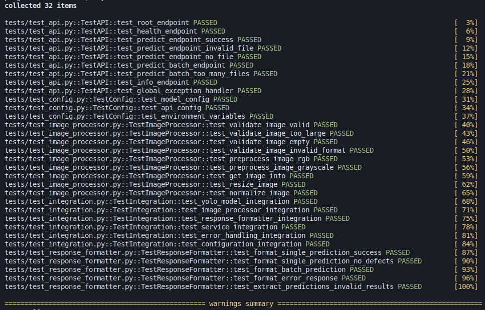

# DefectNet [](https://www.python.org/downloads/) [](https://opensource.org/licenses/MIT) [](https://github.com/stuartasiimwe7/DefectNet/actions/workflows/tests.yml) [](https://github.com/stuartasiimwe7/DefectNet/actions/workflows/ci-cd.yml)

A RestFul API for automated detecting of defects in Printed Circuit Boards (PCBs) using YOLOv5 deep learning models, built with FastAPI.

## Challenge

Manual PCB defect inspection is time-consuming, error-prone, and inconsistent. Automated visual inspection systems can significantly improve quality control in electronics manufacturing by providing fast, accurate, and consistent defect detection.

## Solution

DefectNet provides a robust, scalable REST API service that uses computer vision and deep learning to automatically detect and classify PCB defects with high accuracy.

## System Architecture

```
┌─────────────────┐    ┌─────────────────┐    ┌─────────────────┐
│   FastAPI App   │    │  YOLOv5 Model   │    │  Image Processor│
│   (REST API)    │<──>│   (Detection)   │<──>│  (Preprocessing)│
└─────────────────┘    └─────────────────┘    └─────────────────┘
         │                       │                       │
         v                       v                       v
┌─────────────────┐    ┌─────────────────┐    ┌─────────────────┐
│ Response        │    │ Configuration   │    │ Error Handling  │
│ Formatter       │    │ Management      │    │ & Logging       │
└─────────────────┘    └─────────────────┘    └─────────────────┘
```

## Key Features

- Real-time defect detection for single images
- Batch processing for multiple images
- RESTful API with comprehensive error handling
- Rate limiting (100 req/min single, 20 req/min batch)
- Modular architecture with separation of concerns
- Environment-based configuration management
- Docker containerization support
- Full test coverage with unit, integration, and API tests

## Project Structure

```
DefectNet/
├── app.py
├── config.py
├── requirements.txt
├── Dockerfile
├── src/
│   ├── models/
│   │   └── yolo_model.py
│   ├── utils/
│   │   ├── image_processor.py
│   │   └── response_formatter.py
│   └── services/
│       └── defect_detection_service.py
├── tests/
│   ├── test_api.py
│   ├── test_config.py
│   ├── test_image_processor.py
│   ├── test_response_formatter.py
│   └── test_integration.py
└── data/
```

## Performance Metrics

- Inference Time: ~45ms per image (CPU)
- Batch Processing: ~40ms per image
- Memory Usage: ~500MB base + model size
- Throughput: ~20 images/second (single-threaded)

## Detectable Defect Types

- Missing components
- Solder bridges
- Open circuits
- Short circuits
- Component misalignment
- Solder defects
- Contamination

## Technology Stack

FastAPI & Uvicorn | YOLOv5 | Pillow & NumPy | pytest & pytest-mock | Docker | REST-API

## Test Coverage

There is comprehensive test coverage across all components with 32 passing tests.



**Test Categories:**
- API Tests (9): Endpoint functionality, error handling, file uploads
- Configuration Tests (3): Configuration management and environment variables
- Image Processor Tests (9): Image validation, preprocessing, and normalization
- Response Formatter Tests (5): Result formatting and error responses
- Integration Tests (6): End-to-end system integration

## Installation and Setup

**Prerequisites:** Python 3.8+ (see requirements.txt for dependencies)

### Want to replicate?

    ```bash
# Clone and navigate
git clone https://github.com/stuartasiimwe7/DefectNet
cd DefectNet

# Setup virtual environment
python -m venv .venv
source .venv/bin/activate  # Windows: .venv\Scripts\activate

# Install dependencies
    pip install -r requirements.txt

# Verify with tests
python -m pytest tests/ -v

# Start server
uvicorn app:app --reload --host 0.0.0.0 --port 8000
    ```

### Docker Setup

**Option 1: Pull from GitHub Container Registry**
    ```bash
docker pull ghcr.io/stuartasiimwe7/defectnet:latest
docker run -p 8000:8000 ghcr.io/stuartasiimwe7/defectnet:latest
    ```

**Option 2: Build locally**
    ```bash
docker build -t defectnet .
docker run -p 8000:8000 defectnet
```

## Usage Examples

**Health Check:**
```bash
curl http://localhost:8000/health
```

**Single Image Prediction:**
```bash
curl -X POST "http://localhost:8000/predict/" \
  -H "Content-Type: multipart/form-data" \
  -F "file=@pcb_image.jpg"
```

**Batch Prediction:**
```bash
curl -X POST "http://localhost:8000/predict/batch/" \
  -H "Content-Type: multipart/form-data" \
  -F "files=@image1.jpg" \
  -F "files=@image2.jpg"
```

See [API_DOCUMENTATION.md](API_DOCUMENTATION.md) for detailed API reference

## Configuration

Set environment variables for customization:

```bash
# Model settings
MODEL_PATH=models/trained_model.pt
CONFIDENCE_THRESHOLD=0.5
MAX_IMAGE_SIZE=1024

# API settings
API_HOST=0.0.0.0
API_PORT=8000
MAX_BATCH_SIZE=10
MAX_FILE_SIZE_MB=1

# Logging
LOG_LEVEL=INFO
```

## CI/CD Pipeline

This project uses GitHub Actions for continuous integration and deployment:

**Continuous Integration:**
- Automated testing on every push/PR
- Code linting with flake8
- Python 3.12 compatibility checks

**Continuous Deployment:**
- Automatic Docker image builds on main branch
- Published to GitHub Container Registry
- Tagged with commit SHA and latest

## Testing

Run all tests:
```bash
python -m pytest tests/ -v
```

Run specific test categories:
```bash
python -m pytest tests/test_api.py -v
python -m pytest tests/test_integration.py -v
```

Run with coverage report:
```bash
python -m pytest tests/ --cov=src --cov-report=html
```

## Documentation

- [API Documentation](API_DOCUMENTATION.md) - Detailed API reference

## License

This project is licensed under the MIT License - see the [LICENSE](LICENSE) file for details.

## Acknowledgments

Built using YOLOv5 by Ultralytics and FastAPI framework.
